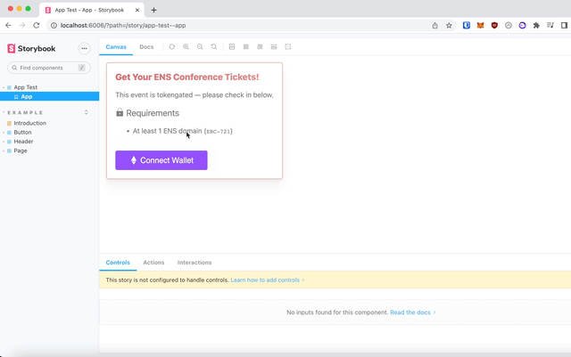

# Magicwall 🏛️ 🪄
## A React Component for Tokengating

Magicwall is a proof-of-concept React component that uses the Unfold scripting language to tokengate content. 

If you want to use this in your own project, you need to generate a JWT (or something similar) from a server to properly authenticate Metamask users. This entire component is client side.

## Features
- Basic "Connect to Metamask" Flow
- Incorporates the Unfold scripting language for tokengating from a sandboxed runtime
- Can be extended to other tokengating needs
- Storyboard files for easy prototyping